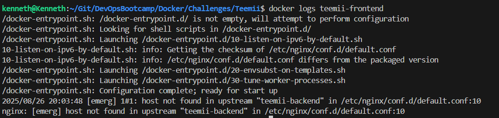
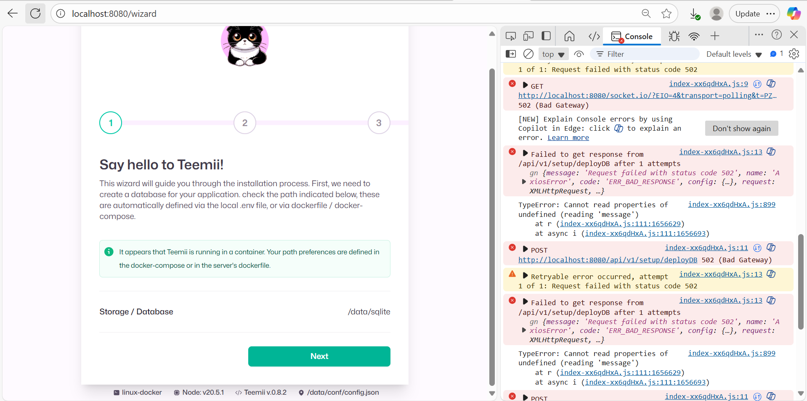
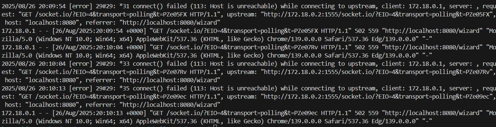
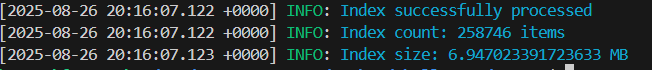
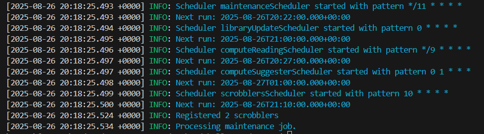
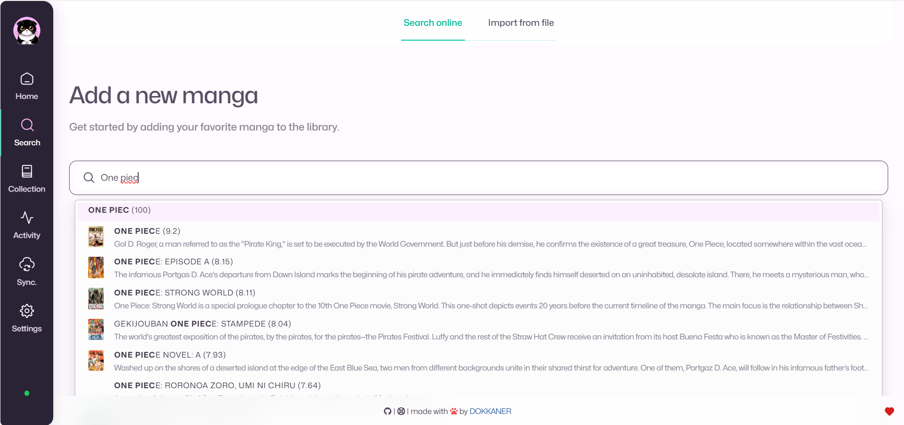

# Teemii
Teemii is a web application that developed by a third party, it is used to manage information of different mangas.

The focus of this challenge is to demonstrate the capabilities of Docker, by being able to run both of the containers by manually running them or doing it automatically through `docker compose`.

Teemii consists of *2 different components*.

### Frontend
The published image can be found [here](https://hub.docker.com/r/dokkaner/teemii-frontend). In order to have access to the frontend we need to map a port to the port 80 inside of the container. It is also required to have the backend running for this application to be functional.

### Backed
The published image can be found [here](https://hub.docker.com/r/dokkaner/teemii-backend). The backend works through ports 3000 (REST API connection) and port 1555 (Web Sockets connection). Which means that the front end needs to be able to see these ports, but they will not be exposed to the public. The backend also requires persistent data which lives in `/data`.

## Manual Implementation
In order for the application to work correctly we need to first have the two images avialable:
1. `docker pull dokkaner/teemii-backend`
2. `docker pull dokkaner/teemii-frontend`

For the applications to have the required communication between each other, we need to create a bridge. This will allow communication between the containers without exposing the ports.
1. `docker network create teemii-network`

The backend application has the need of creating a volume for persistent data.
1. `docker volume create teemii-data`

With all these requirements satisfied, we are now able to execute the following command to set the volume, network and name of the containers that we will be creating.
1. `docker run -d --name teemii-backend --network teemii-network -v teemii-data:/data dokkaner/teemii-backend`
2. `docker run -d -p 8080:80 --env VITE_APP_TITLE=Teemii --env VITE_APP_PORT=80 --name teemii-frontend --network teemii-network dokkaner/teemii-frontend`

Once all these commands have been executed we are able to access the application in a web browser by going to `http://localhost:8080`.

## Automatic Implementation
We can run all these commands automatically by creating a configuration file with all of the previously given options. This file is the `docker-compose.yml`. To run it we can just run the command `docker compose up`.

## Results Validation

### Frontend Only
We can validate the frontend to see if it is running by accessing the browser at `http://localhost:8080`, if there is nothing then we can check the logs to see if the backend service was up and running or if we suddenly lost connection.

In case the backend service is not up when trying to execute the frontend container, then the application will not be able to run and will show something similar to this in the logs: 

If there is a sudden loss of connection with the backend service, but we were able to access the web browser application then we will not be able to continue using the app. It will show these error messages in the browser:

And the `docker logs teemii-frontend` command will show the following errors:

### Backend Only
We can check the logs to see if the backend of the application is running properly. If the following messages appear in the logs by using `docker logs teemii-backend` then we have a functional backend: 

Once we do the initial setup in the Frontend, then we will be able to see more messages on the backend such as:

### Frontend + Backend
If everything was set up properly then the application can be accessed properly without any issues. And after the initial app set up you will be able to access the following menu to search for Mangas:

## Comparison of approaches
| Metric | Manual | Automatic |
---------|--------|------------
| Complexity | Easier to manage when working with single container applications. | Most useful when there is a need to work with multiple containers. |
|Reproducibility | Requires a step by step approach to create all the necessary volumes and networks before creating the containers. | You just need to create a configuration once and then it will be able to run with a single command. |
|Dependency Management| Requires dependencies to be up an running before creating the container. | Can easily manage dependencies. |
|Development| More difficult to create multi-container production-like environments. | Allows you to replicate production-like environments with ease.|
| Testing | Better for single service testing, running ephemeral tools and building custom images for deployment. | Better for testing multi-container apps and replicating environments locally. | 